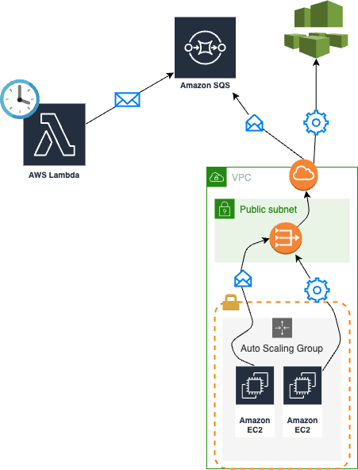
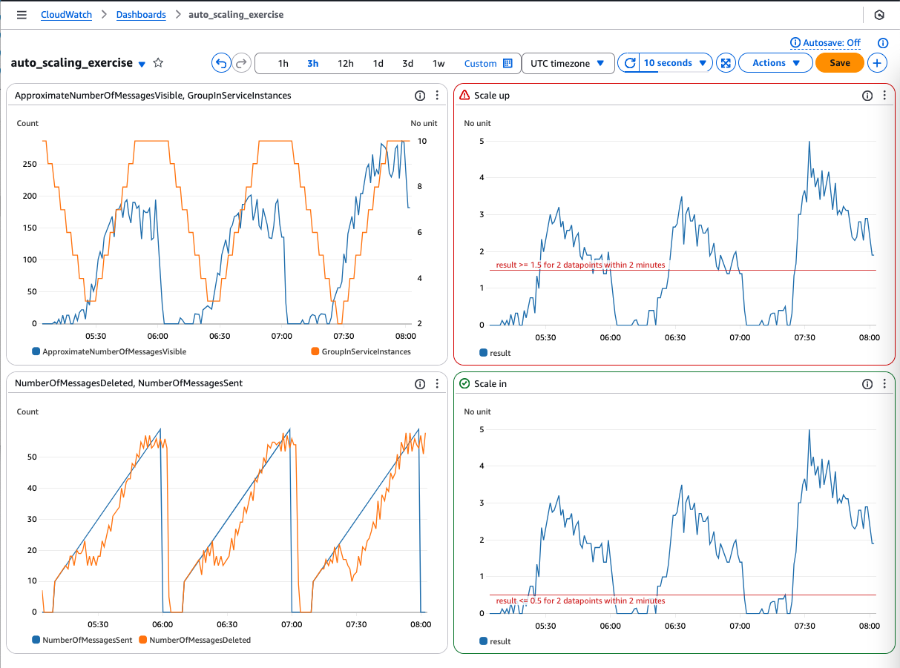

# auto-scaling-exercise

## Requirements

### Technical
- CI/CD
  - Terraform cloud
  - Infracost
- EC2's are 
  - in private subnet
  - can be reached with Session Manager connect
- Cost aware

### Functional
- Queue for messages
- Producer
  - that sends as many messages as the current time's minute part or none, if mins < 10
  - time triggered every 1 min
- Consumer(s)
  - Number of consumer
    - min 0
    - desired: queue size / 10
    - max 10
  - a single consumer can process a message in every 10 sec
- Metrics
  - X
    - time
  - Y
    - Queue size
    - Number of consumers

## Architecture diagram

## Sample chart

